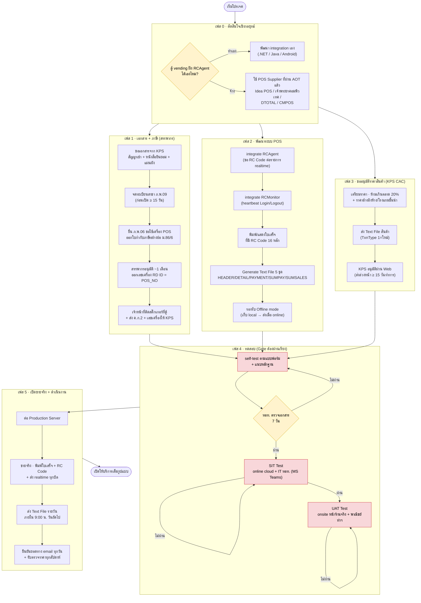
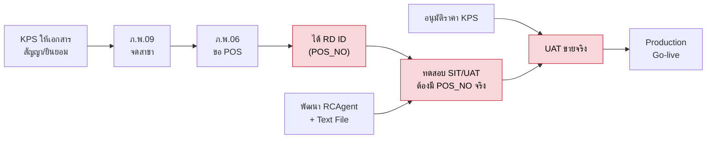
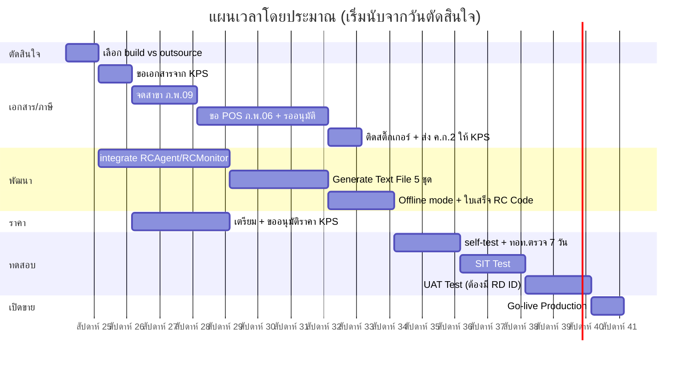
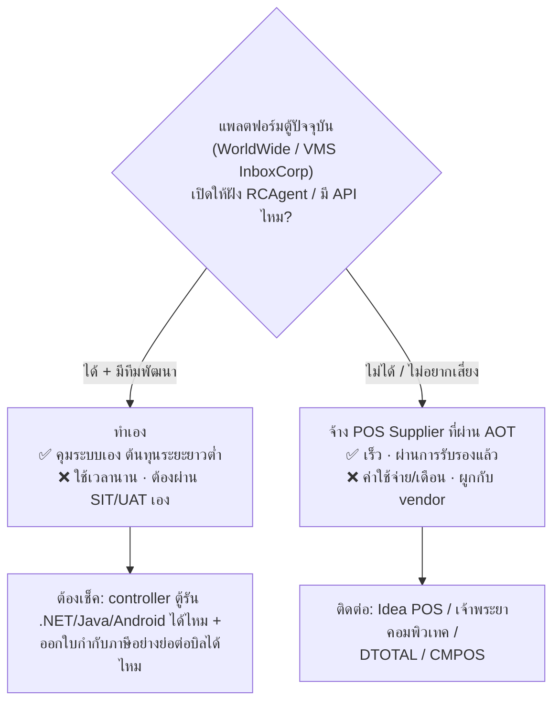

# แผนผังงาน — โปรเจคลงตู้ที่สนามบิน (King Power / AOT RR)

> ที่มา: King Power สุวรรณภูมิ (KPS) แจ้งให้เราดำเนินการตามชุดเอกสาร "คู่มือ - พัฒนาโปรแกรม POS สำหรับตู้ Vending"
> เป้าหมาย: ลงตู้ขายในพื้นที่สนามบิน → ต้องเชื่อมระบบขายเข้ากับ **AOT Revenue Reconciliation (AOT RR)**
> เอกสารต้นทาง: `คู่มือ - พัฒนาโปรแกรม POS สำหรับตู้ Vending/` (อ่านสรุปไว้ที่ [[#สรุปข้อกำหนดย่อ]])

---

## 🗺️ แผนผังงานหลัก (Master Workflow)

---

## ⛓️ ลำดับการพึ่งพา (Critical Path)

> **คอขวด (สีแดง):** การได้ **RD ID จากสรรพากร** กั้นการทดสอบ — เริ่มงานภาษีให้เร็วที่สุดเพราะกินเวลา ~1 เดือนและขึ้นกับหน่วยงานราชการ ทำคู่ขนานกับการพัฒนาได้

---

## 📅 Timeline โดยประมาณ (Gantt)

> ⏱️ **รวมประมาณ 3–4 เดือน** ถ้าทำเอง · จะเร็วขึ้นมากถ้าใช้ POS supplier ที่ผ่าน AOT แล้ว (ข้ามงานพัฒนา RCAgent)

---

## 🔀 จุดตัดสินใจหลัก: ทำเอง vs จ้าง

---

## ✅ Checklist รวม

### เฟส 1 — เอกสาร/ภาษี
- [ ] ขอจาก KPS: สัญญาเช่า KPS–AOT, สัญญา KPS–เรา, หนังสือยินยอมใช้สถานที่, แผนผังที่ตั้ง, เลขที่
- [ ] จดทะเบียนสาขา **ภ.พ.09** (5 ชุด) ที่สรรพากรพื้นที่สำนักงานใหญ่ — ก่อนเปิด ≥15 วัน
- [ ] ยื่น **ภ.พ.06** (+ ภ.พ.01, ภ.พ.09, หนังสือรับรองบริษัท, คู่มือ POS, แผนผังโปรแกรม/การวางเครื่อง, ตัวอย่างใบกำกับภาษีอย่างย่อ)
- [ ] รับ **RD ID (POS_NO)** จากสรรพากร
- [ ] เจ้าหน้าที่ติดสติ๊กเกอร์ที่ตู้
- [ ] ส่ง **ค.ก.2** + รายละเอียดเลขเครื่องให้ KPS

### เฟส 2 — พัฒนา
- [ ] integrate **RCAgent** (ขอ RC Code realtime ต่อบิล)
- [ ] integrate **RCMonitor** (heartbeat, เปิดตลอดเวลา)
- [ ] ใบเสร็จ/ใบกำกับภาษีอย่างย่อ พิมพ์ **RC Code 16 หลัก**
- [ ] Generate **Text File 5 ชุด** (pipe-delimited, ชื่อ `Shopcode_Sales_YYYYMMDDHHMMSS.txt`)
- [ ] ตรวจกฎ: `SALE_HEADER_AMT == SALE_DTL_AMT`, void = ยอดติดลบ
- [ ] รองรับ **Offline** (เก็บ local → ส่งเมื่อ online)

### เฟส 3 — ราคา (KPS CAC)
- [ ] ทำราคา ≤ ตลาด +20% + เตรียมราคาอ้างอิง (ห้าง/โรงแรมชั้นนำ กทม.)
- [ ] ส่ง Text File สินค้า (Product Code ห้ามซ้ำ, ชื่ออังกฤษ) — ล่วงหน้า ≥15 วันทำการ
- [ ] รับผลอนุมัติผ่าน Web

### เฟส 4 — ทดสอบ
- [ ] self-test ตามแบบฟอร์ม + แนบหลักฐาน → ทอท. ตรวจ 7 วัน
- [ ] ผ่าน **SIT** (online, IT ทอท.)
- [ ] ผ่าน **UAT** (onsite, พาณิชย์ท่าฯ)

### เฟส 5 — ดำเนินงานต่อเนื่อง
- [ ] ส่ง Text File รายวันภายใน 9:00 น.
- [ ] ยืนยันยอดทาง email ทุกวัน · วันไม่มีขายแจ้งเป็นลายลักษณ์อักษร
- [ ] รับตรวจราคารายสัปดาห์ · ส่งรายได้รับรองผู้สอบบัญชี (45 วัน) · งบการเงิน (5 เดือน)

---

## 📌 สรุปข้อกำหนดย่อ
- **2 ส่วนคู่กัน:** Realtime (RCAgent/RCMonitor) + Text File รายวัน (5 datasets)
- **Text File:** pipe `|` คั่น, 1 record/บรรทัด, ส่งภายใน 9:00 น. วันถัดไป
- **ทดสอบเป็น gate:** เอกสาร(7วัน) → SIT → UAT → Production
- **ต่างจากระบบเดิม:** ปัจจุบันดึงยอดจาก VMS/WorldWide · อันนี้ตู้ต้องเป็น POS ออกใบกำกับภาษีเอง

## ☎️ ผู้ติดต่อ
- **ICT (ทดสอบ Text File):** คุณธงชัย 02-134-8888 ต่อ 2017 · thongchai_j@kingpower.com
- **ICT เพิ่มเติม:** คุณธเนศ ต่อ 2071 · คุณศรัณญู ต่อ 2074
- **การตลาด KPS (เอกสารจดทะเบียน):** คุณปานทิพย์ ต่อ 7715 · คุณนพดล ต่อ 7711
- **ตรวจสอบรายได้:** คุณทรงพล (ผจก.) ต่อ 7744 · สาขาสุวรรณภูมิ ต่อ 7750/7743

## 🔗 เกี่ยวข้อง
- ตู้ปัจจุบัน: [[wwv05]] (WorldWide) · [[chukes01]] (VMS) — แพลตฟอร์มที่ต้องเช็คว่าฝัง RCAgent ได้ไหม
